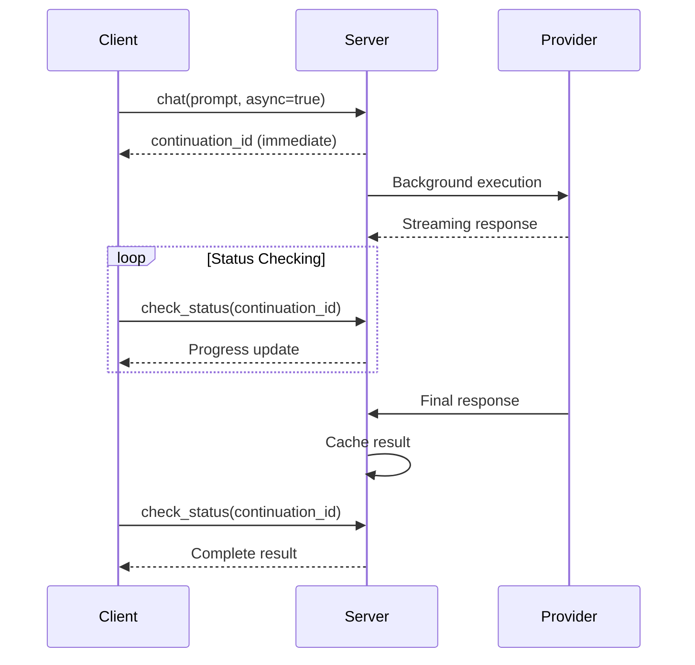

# Converse MCP Server - API Reference

## Overview

The Converse MCP Server provides four main tools through the Model Context Protocol (MCP):

1. **Chat Tool** - Single-provider conversational AI with context support and AI summarization
2. **Consensus Tool** - Multi-provider parallel execution with response aggregation and combined summaries
3. **Check Status Tool** - Monitor and retrieve results from asynchronous operations with intelligent summaries
4. **Cancel Job Tool** - Cancel running background operations

All tools support both **synchronous** (immediate response) and **asynchronous** (background processing) execution modes. When AI summarization is enabled, tools automatically generate titles and summaries for better context understanding.

## Transport Protocols

The server supports two transport modes:

### HTTP Transport (Default)
- **Endpoint**: `http://localhost:3157/mcp` 
- **Protocol**: HTTP streaming with JSON-RPC 2.0
- **Usage**: Best for development, debugging, and web integrations
- **Features**: Health endpoints, CORS support, session management

### Stdio Transport (Legacy)
- **Protocol**: Standard input/output with JSON-RPC 2.0
- **Usage**: Traditional MCP client integrations
- **Features**: Process-based communication, lower latency

**Transport Selection:**
```bash
# Default (HTTP)
npm start

# Explicit HTTP
npm start -- --transport=http

# Stdio transport
npm start -- --transport=stdio

# Environment variable
MCP_TRANSPORT=stdio npm start
```

## Tool Schemas

### Chat Tool

**Description**: General conversational AI with context and continuation support.

#### Request Schema

```json
{
  "type": "object",
  "properties": {
    "prompt": {
      "type": "string",
      "description": "Your question or topic with relevant context. Example: 'How should I structure the authentication module for this Express.js API?'"
    },
    "model": {
      "type": "string", 
      "description": "AI model to use. Examples: 'auto' (recommended), 'gemini-2.5-flash', 'gpt-5', 'grok-4'. Default: 'auto'"
    },
    "files": {
      "type": "array",
      "items": {"type": "string"},
      "description": "File paths to include as context (absolute paths required). Example: ['/path/to/src/auth.js', '/path/to/config.json']"
    },
    "images": {
      "type": "array", 
      "items": {"type": "string"},
      "description": "Image paths for visual context (absolute paths or base64). Example: ['/path/to/diagram.png', 'data:image/jpeg;base64,...']"
    },
    "continuation_id": {
      "type": "string",
      "description": "Continuation ID for persistent conversation. Example: 'chat_1703123456789_abc123'"
    },
    "temperature": {
      "type": "number",
      "minimum": 0.0,
      "maximum": 1.0,
      "default": 0.5,
      "description": "Response randomness (0.0-1.0). Examples: 0.2 (focused), 0.5 (balanced), 0.8 (creative)"
    },
    "reasoning_effort": {
      "type": "string",
      "enum": ["minimal", "low", "medium", "high", "max"],
      "default": "medium", 
      "description": "Reasoning depth for thinking models. Examples: 'minimal' (fastest, few reasoning tokens), 'low' (light analysis), 'medium' (balanced), 'high' (complex analysis)"
    },
    "verbosity": {
      "type": "string",
      "enum": ["low", "medium", "high"],
      "default": "medium",
      "description": "Output verbosity for GPT-5 models. Examples: 'low' (concise answers), 'medium' (balanced), 'high' (thorough explanations)"
    },
    "use_websearch": {
      "type": "boolean",
      "default": false,
      "description": "Enable web search for current information. Example: true for framework docs, false for private code analysis"
    },
    "media_resolution": {
      "type": "string",
      "enum": ["low", "medium", "high"],
      "default": "high",
      "description": "Control image/PDF/video processing quality (Gemini 3.0 only). Defaults to 'high' for Gemini 3.0. Examples: 'low' (faster, less detail), 'medium' (balanced), 'high' (maximum detail)"
    },
    "async": {
      "type": "boolean",
      "default": false,
      "description": "Execute in background mode. Returns continuation_id immediately for status monitoring. Example: true for long-running analysis"
    }
  },
  "required": ["prompt"]
}
```

#### Response Format

**Synchronous Response (async=false):**
```json
{
  "content": "AI response text",
  "continuation": {
    "id": "conv_d6a6a5ec-6900-4fd8-a4e0-1fa4f75dfc42",
    "provider": "openai",
    "model": "gpt-4o-mini",
    "messageCount": 3
  },
  "metadata": {
    "model": "gpt-4o-mini",
    "usage": {
      "input_tokens": 150,
      "output_tokens": 85,
      "total_tokens": 235
    },
    "response_time_ms": 1247,
    "provider": "openai"
  },
  "title": "Authentication Module Structure Guide",  // When summarization enabled
  "final_summary": "Provided architectural recommendations for Express.js auth module with JWT tokens and role-based access control."  // When summarization enabled
}
```

**Asynchronous Response (async=true):**
```json
{
  "content": "⏳ PROCESSING | CHAT | conv_abc123def | 1/1 | Started: 2023-12-01 10:30:00 | openai/gpt-5",
  "continuation": {
    "id": "conv_abc123def",
    "status": "processing"
  },
  "async_execution": true
}
```

#### Example Usage

```json
{
  "prompt": "Review this authentication function for security issues",
  "model": "o3",
  "files": ["/project/src/auth.js", "/project/config/security.json"],
  "temperature": 0.2,
  "reasoning_effort": "high"
}
```

### Consensus Tool

**Description**: Multi-provider parallel execution with cross-model feedback for gathering perspectives from multiple AI models.

#### Request Schema

```json
{
  "type": "object", 
  "properties": {
    "prompt": {
      "type": "string",
      "description": "The problem or proposal to gather consensus on. Example: 'Should we use microservices or monolith architecture for our e-commerce platform?'"
    },
    "models": {
      "type": "array",
      "items": {"type": "string"},
      "minItems": 1,
      "description": "List of models to consult. Example: ['o3', 'gemini-2.5-flash', 'grok-4']"
    },
    "files": {
      "type": "array",
      "items": {"type": "string"},
      "description": "File paths for additional context. Example: ['/path/to/architecture.md', '/path/to/requirements.txt']"
    },
    "images": {
      "type": "array",
      "items": {"type": "string"}, 
      "description": "Image paths for visual context. Example: ['/path/to/architecture.png', '/path/to/user_flow.jpg']"
    },
    "continuation_id": {
      "type": "string",
      "description": "Thread continuation ID for multi-turn conversations. Example: 'consensus_1703123456789_xyz789'"
    },
    "enable_cross_feedback": {
      "type": "boolean",
      "default": true,
      "description": "Enable refinement phase where models see others' responses. Example: true (recommended), false (faster)"
    },
    "cross_feedback_prompt": {
      "type": "string",
      "description": "Custom prompt for refinement phase. Example: 'Focus on scalability trade-offs in your refinement'"
    },
    "temperature": {
      "type": "number",
      "minimum": 0.0, 
      "maximum": 1.0,
      "default": 0.2,
      "description": "Response randomness. Examples: 0.1 (very focused), 0.2 (analytical), 0.5 (balanced)"
    },
    "reasoning_effort": {
      "type": "string",
      "enum": ["minimal", "low", "medium", "high", "max"],
      "default": "medium",
      "description": "Reasoning depth. Examples: 'medium' (balanced), 'high' (complex analysis), 'max' (thorough evaluation)"
    },
    "async": {
      "type": "boolean",
      "default": false,
      "description": "Execute in background mode with per-provider progress tracking. Returns continuation_id immediately for monitoring."
    }
  },
  "required": ["prompt", "models"]
}
```

#### Response Format

**Synchronous Response (async=false):**
```json
{
  "status": "consensus_complete",
  "models_consulted": 3,
  "successful_initial_responses": 3,
  "failed_responses": 0,
  "refined_responses": 3,
  "title": "Architecture Review Recommendations",  // When summarization enabled
  "final_summary": "All models agree on microservices approach with event-driven architecture for scalability.",  // When summarization enabled  
  "phases": {
    "initial": [
      {
        "model": "o3",
        "status": "success",
        "response": "Initial analysis from O3...",
        "metadata": {
          "provider": "openai",
          "input_tokens": 200,
          "output_tokens": 150,
          "response_time": 2500
        }
      }
    ],
    "refined": [
      {
        "model": "o3", 
        "status": "success",
        "initial_response": "Initial analysis...",
        "refined_response": "After considering other perspectives...",
        "metadata": {
          "total_response_time": 4800,
          "total_input_tokens": 450,
          "total_output_tokens": 320
        }
      }
    ],
    "failed": []
  },
  "continuation": {
    "id": "consensus_xyz789",
    "messageCount": 2
  },
  "settings": {
    "enable_cross_feedback": true,
    "temperature": 0.2,
    "models_requested": ["o3", "gemini-2.5-flash", "grok-4"]
  }
}
```

**Asynchronous Response (async=true):**
```json
{
  "content": "⏳ PROCESSING | CONSENSUS | consensus_xyz789 | 0/3 | Started: 2023-12-01 10:30:00 | gpt-5,gemini-2.5-pro,grok-4",
  "continuation": {
    "id": "consensus_xyz789",
    "status": "processing"
  },
  "async_execution": true,
  "metadata": {
    "total_models": 3,
    "successful_models": 0,
    "models_list": "gpt-5,gemini-2.5-pro,grok-4"
  }
}
```

#### Example Usage

```json
{
  "prompt": "What's the best database solution for a high-traffic social media platform?",
  "models": [
    {"model": "o3"},
    {"model": "gemini-2.5-pro"}, 
    {"model": "grok-4"}
  ],
  "files": ["/docs/requirements.md", "/docs/current_architecture.md"],
  "enable_cross_feedback": true,
  "temperature": 0.1,
  "reasoning_effort": "high"
}
```

## Supported Models

### OpenAI Models

| Model | Context | Tokens | Features | Use Cases |
|-------|---------|--------|----------|-----------|
| `o3` | 200K | 100K | Reasoning | Logic, analysis, complex problems |
| `o3-mini` | 200K | 100K | Fast reasoning | Balanced performance/speed |
| `o4-mini` | 200K | 100K | Latest | General purpose, rapid reasoning |
| `gpt-4o` | 128K | 16K | Multimodal | Vision, general chat |
| `gpt-4o-mini` | 128K | 16K | Fast multimodal | Quick responses, images |

### Google/Gemini Models

| Model | Alias | Context | Tokens | Features | Use Cases |
|-------|-------|---------|--------|----------|-----------|
| `gemini-3-pro-preview` | `pro`, `gemini` | 1M | 64K | Thinking levels, enhanced reasoning | Complex problems, deep analysis |
| `gemini-2.5-flash` | `flash` | 1M | 65K | Ultra-fast | Quick analysis, simple queries |
| `gemini-2.5-pro` | `pro 2.5` | 1M | 65K | Thinking mode | Deep reasoning, architecture |
| `gemini-2.0-flash` | `flash2` | 1M | 65K | Latest | Experimental thinking |

**Note:** Default aliases `gemini`, `pro`, and `gemini-pro` now point to Gemini 3.0 Pro. Use `gemini-2.5-pro` explicitly if you need the 2.5 version.

### X.AI/Grok Models

| Model | Alias | Context | Tokens | Features | Use Cases |
|-------|-------|---------|--------|----------|-----------|
| `grok-4-0709` | `grok`, `grok-4` | 256K | 256K | Advanced | Latest capabilities |
| `grok-code-fast-1` | `grok-code-fast` | 256K | 256K | Code optimization | Agentic coding |

### Anthropic Models

| Model | Alias | Context | Tokens | Features | Use Cases |
|-------|-------|---------|--------|----------|-----------|
| `claude-opus-4-1-20250805` | `opus-4.1`, `opus-4`, `opus` | 200K | 32K | Extended thinking, images, caching | Complex reasoning tasks |
| `claude-sonnet-4-20250514` | `sonnet-4`, `sonnet` | 200K | 64K | Extended thinking, images, caching | High performance, balanced |
| `claude-3-7-sonnet-20250219` | `sonnet-3.7` | 200K | 64K | Extended thinking, images, caching | Enhanced 3.x generation |
| `claude-3-5-sonnet-20241022` | `claude-3.5-sonnet` | 200K | 8K | Images, caching | Fast and intelligent |
| `claude-3-5-haiku-20241022` | `haiku` | 200K | 8K | Caching | Fastest, simple queries |

**Prompt Caching (Always Enabled):**
- System prompts are automatically cached for 1 hour using Anthropic's prompt caching
- Reduces latency and costs for repeated requests with the same system prompt
- Minimum 1024 tokens required for caching (2048 for Haiku models)
- Cache information available in response metadata: `cache_creation_input_tokens` and `cache_read_input_tokens`

### DeepSeek Models

| Model | Alias | Context | Tokens | Features | Use Cases |
|-------|-------|---------|--------|----------|-----------|
| `deepseek-v3` | `deepseek-chat`, `deepseek` | 128K | 64K | Latest model | General purpose AI |
| `deepseek-coder-v2.5` | `deepseek-coder` | 128K | 16K | Code optimization | Programming tasks |

### Mistral Models

| Model | Alias | Context | Tokens | Features | Use Cases |
|-------|-------|---------|--------|----------|-----------|
| `magistral-medium-2506` | `magistral`, `magistral-medium` | 40K | 8K | Reasoning model | Complex reasoning |
| `magistral-small-2506` | `magistral-small` | 40K | 8K | Small reasoning | Fast reasoning |
| `mistral-medium-2505` | `mistral-medium`, `mistral` | 128K | 32K | Multimodal | General + images |

### OpenRouter Models

| Model | Alias | Context | Tokens | Features | Use Cases |
|-------|-------|---------|--------|----------|-----------|
| `kimi/k2` | `k2`, `kimi-k2` | 256K | 128K | Latest Kimi | Large context tasks |
| `qwen/qwen-2.5-coder-32b-instruct` | `qwen-coder` | 32K | 32K | Code focus | Programming |
| `qwen/qwq-32b-preview` | `qwen-thinking`, `qwq` | 32K | 32K | Reasoning | Step-by-step thinking |

### Codex Models

**Codex** is an agentic coding assistant with direct filesystem access:

- **Model**: `codex`
- **Thread-based sessions**: Persistent conversation history via continuation_id
- **Direct file access**: Reads files from working directory (paths relative to CLIENT_CWD)
- **Response times**: 6-20 seconds typical (complex tasks may take minutes)
- **Authentication**: Requires ChatGPT login OR `CODEX_API_KEY` environment variable

**Codex-Specific Behavior:**
- `continuation_id` - Required for thread continuation (maintains full conversation history)
- `files` parameter - Files accessed directly from working directory, not passed as message content
- `temperature`, `use_websearch` - Not supported by Codex (ignored if specified)
- Responses significantly longer than API-based providers

**Configuration (see [Codex Configuration](#codex-configuration) section):**
- `CODEX_SANDBOX_MODE` - Filesystem access control
- `CODEX_SKIP_GIT_CHECK` - Git repository requirement
- `CODEX_APPROVAL_POLICY` - Command approval behavior
- `CODEX_DEFAULT_MODEL` - Default model when using `model: 'codex'`

### Model Selection

Use `"auto"` for automatic selection or specify exact models:

```json
// Automatic selection (recommended)
{"model": "auto"}

// Specific models  
{"model": "gemini-2.5-flash"}
{"model": "o3"}
{"model": "grok-4-0709"}

// Using aliases
{"model": "flash"}  // -> gemini-2.5-flash
{"model": "pro"}    // -> gemini-2.5-pro  
{"model": "grok"}   // -> grok-4-0709
{"model": "grok-4"}  // -> grok-4-0709
```

## Configuration

### AI Summarization

Configure intelligent title and summary generation for better context understanding:

```bash
# Environment variables
ENABLE_RESPONSE_SUMMARIZATION=true    # Enable AI-powered summarization (default: false)
SUMMARIZATION_MODEL=gpt-5-nano        # Model for summarization (default: gpt-5-nano)
```

**When Enabled:**
- Automatic title generation (up to 60 chars) for each request
- Status check returns an up-to-date summary of the progress based on the partially streamed response  
- Final summaries (1-2 sentences) for completed responses
- Enhanced check_status display with titles and summaries
- Persistent storage of summaries with async jobs

**Implementation Details:**
- Uses fast models (gpt-5-nano, gemini-2.5-flash) for minimal latency
- Temperature set to 0.3 for consistent, focused summaries
- Graceful fallback to text snippets when disabled or on errors
- Non-blocking - summarization failures don't affect main flow

### Codex Configuration

Control Codex behavior through environment variables:

**CODEX_SANDBOX_MODE** - Filesystem access control:
- `read-only` (default): Can read files but not modify
- `workspace-write`: Can modify files in workspace only
- `danger-full-access`: Full filesystem access (use in containers only)

**CODEX_SKIP_GIT_CHECK** - Git repository requirement:
- `true` (default): Works in any directory
- `false`: Requires working directory to be a Git repository

**CODEX_APPROVAL_POLICY** - Command approval behavior:
- `never` (default): Never prompt for approval (recommended for servers)
- `untrusted`: Prompt for untrusted commands
- `on-failure`: Prompt when commands fail
- `on-request`: Let model decide (may hang in headless mode)

**CODEX_DEFAULT_MODEL** - Default model when `model: 'codex'`:
- Default: `gpt-5-codex`

**Authentication:**
- Requires ChatGPT login (system-wide, persists across restarts)
- Alternative: Set `CODEX_API_KEY` environment variable for headless deployments

**Example Configuration (.env file):**
```bash
# Codex authentication (optional if ChatGPT login available)
CODEX_API_KEY=your_codex_api_key_here

# Codex behavior
CODEX_SANDBOX_MODE=read-only                 # Default: read-only
CODEX_SKIP_GIT_CHECK=true                    # Default: true
CODEX_APPROVAL_POLICY=never                  # Default: never
CODEX_DEFAULT_MODEL=gpt-5-codex              # Default: gpt-5-codex
```

## Context Processing

### File Support

**Supported Text Formats:**
- `.txt`, `.md`, `.js`, `.ts`, `.json`, `.yaml`, `.yml`
- `.py`, `.java`, `.c`, `.cpp`, `.h`, `.css`, `.html`
- `.xml`, `.csv`, `.sql`, `.sh`, `.bat`, `.log`

**Supported Image Formats:**
- `.jpg`, `.jpeg`, `.png`, `.gif`, `.webp`, `.bmp`

**Size Limits:**
- Text files: 1MB default
- Image files: 10MB default

### File Processing

```json
{
  "files": [
    "/absolute/path/to/file.js",
    "./relative/path/to/file.md"
  ]
}
```

**Response includes:**
- File content with line numbers
- Metadata (size, last modified)
- Error handling for inaccessible files

### Image Processing

```json
{
  "images": [
    "/path/to/diagram.png",
    "data:image/jpeg;base64,/9j/4AAQ..."
  ]
}
```

**Features:**
- Base64 encoding for AI processing
- MIME type detection
- Size validation
- Security path checking

## Continuation System

### Creating Conversations

First request creates a continuation automatically:

```json
{
  "prompt": "Start a conversation about architecture",
  "model": "auto"
}
```

Response includes continuation ID:

```json
{
  "content": "Let's discuss architecture...",
  "continuation": {
    "id": "conv_abc123",
    "provider": "openai",
    "model": "gpt-4o-mini",
    "messageCount": 2
  }
}
```

### Continuing Conversations

Use the continuation ID in subsequent requests:

```json
{
  "prompt": "What about microservices?",
  "continuation_id": "conv_abc123"
}
```

**Features:**
- Persistent conversation history
- Provider and model consistency
- Message count tracking
- Automatic expiration

### ⚠️ Known Issues

**Continuation ID Missing (Critical):**
```json
// Some responses may not include continuation metadata
{
  "content": "Response without continuation...",
  // Missing: continuation field
}
```

**Workaround:** Use single-turn interactions until fixed. Track conversation manually if needed.

**Status:** Implementation gap identified in integration testing. High priority fix planned.

## Error Handling

### Common Error Responses

**Missing API Key:**
```json
{
  "error": "Provider not available. Check API key configuration.",
  "code": "PROVIDER_UNAVAILABLE",
  "provider": "openai"
}
```

**Invalid Model:**
```json
{
  "error": "Model not found: invalid-model",
  "code": "MODEL_NOT_FOUND",
  "provider": "openai"
}
```

**Rate Limiting:**
```json
{
  "error": "OpenAI rate limit exceeded", 
  "code": "RATE_LIMIT_EXCEEDED",
  "provider": "openai",
  "retry_after": 60
}
```

**Context Too Large:**
```json
{
  "error": "Context length exceeded for model",
  "code": "CONTEXT_LENGTH_EXCEEDED", 
  "max_tokens": 128000,
  "provided_tokens": 150000
}
```

## Rate Limits & Quotas

### Provider Limits

**OpenAI:**
- Rate limits vary by model and tier
- Automatic retry with exponential backoff
- Error codes: `rate_limit_error`, `insufficient_quota`

**Google:**
- Free tier: 50 requests/day
- Paid: Based on quota settings
- Automatic retry for temporary failures

**X.AI:**
- Based on account tier
- Higher limits for paid accounts
- Standard HTTP 429 handling

### Server Limits

**Default Limits:**
- Max output tokens: 25,000 (configurable to 200,000)
- Request timeout: 5 minutes
- Concurrent requests: Unlimited

**Configuration:**
```bash
MAX_MCP_OUTPUT_TOKENS=200000
REQUEST_TIMEOUT_MS=300000
```

## Authentication

### API Key Management

**Environment Variables:**
```bash
OPENAI_API_KEY=sk-proj-...
GOOGLE_API_KEY=AIzaSy...
XAI_API_KEY=xai-...
```

**MCP Client Configuration:**
```json
{
  "env": {
    "OPENAI_API_KEY": "sk-proj-...",
    "GOOGLE_API_KEY": "AIzaSy...", 
    "XAI_API_KEY": "xai-..."
  }
}
```

### Security

**Features:**
- API keys never logged or exposed
- Path traversal protection for files
- File access limited to allowed directories
- Input validation on all parameters

## Performance

### Response Times

**Typical Performance:**
- Simple chat: 500-2000ms
- Complex reasoning: 2-10 seconds  
- Consensus (3 models): 3-15 seconds
- File processing: <100ms per file

**Optimization:**
- Parallel consensus execution
- Efficient context processing
- Connection pooling
- Response caching for repeated requests

### Monitoring

**Metrics Available:**
- Response times per provider
- Token usage statistics
- Error rates and types
- Request concurrency

**Logging:**
```bash
LOG_LEVEL=debug  # Detailed operation logs
LOG_LEVEL=info   # Standard operation logs
LOG_LEVEL=error  # Errors only
```

## Examples

### Basic Chat

```json
{
  "tool": "chat",
  "arguments": {
    "prompt": "Explain the benefits of TypeScript over JavaScript",
    "model": "gemini-2.5-flash",
    "temperature": 0.3
  }
}
```

### Chat with Context

```json
{
  "tool": "chat", 
  "arguments": {
    "prompt": "Review this code for potential security vulnerabilities",
    "model": "o3",
    "files": ["/project/src/auth.js", "/project/src/middleware.js"],
    "reasoning_effort": "high",
    "temperature": 0.1
  }
}
```

### Simple Consensus

```json
{
  "tool": "consensus",
  "arguments": {
    "prompt": "What's the best approach for implementing real-time notifications?",
    "models": [
      {"model": "o3"},
      {"model": "flash"}, 
      {"model": "grok"}
    ],
    "enable_cross_feedback": false,
    "temperature": 0.2
  }
}
```

### Advanced Consensus

```json
{
  "tool": "consensus",
  "arguments": {
    "prompt": "Design a scalable architecture for a video streaming platform",
    "models": [
      {"model": "o3"},
      {"model": "gemini-2.5-pro"},
      {"model": "grok-4"}
    ],
    "files": [
      "/docs/requirements.md",
      "/docs/current_architecture.md",
      "/docs/performance_goals.md"
    ],
    "images": ["/diagrams/current_system.png"],
    "enable_cross_feedback": true,
    "cross_feedback_prompt": "Focus on scalability and cost optimization in your refinement",
    "temperature": 0.15,
    "reasoning_effort": "max"
  }
}
```

## Troubleshooting

### Debug Mode

Enable detailed logging:

```bash
LOG_LEVEL=debug npx converse-mcp-server
```

### Test API Keys

```bash
# Test OpenAI
curl -H "Authorization: Bearer $OPENAI_API_KEY" https://api.openai.com/v1/models

# Test Google (replace YOUR_KEY)
curl "https://generativelanguage.googleapis.com/v1beta/models?key=YOUR_KEY"

# Test X.AI  
curl -H "Authorization: Bearer $XAI_API_KEY" https://api.x.ai/v1/models
```

### Common Issues

**"No providers available":**
- Check API key environment variables
- Verify API key format and validity
- Ensure at least one provider is configured

**"Context length exceeded":**
- Reduce file content or prompt length
- Use shorter conversation history
- Switch to model with larger context window

**Slow responses:**
- Check network connectivity
- Verify API service status
- Consider using faster models (flash, mini variants)

### 🔍 Integration Test Results & Known Issues

**Provider-Specific Issues:**

**Google Provider:**
```json
{
  "error": "genAI.getGenerativeModel is not a function",
  "status": "connected_with_issues",
  "workaround": "Provider handles gracefully, requests still processed"
}
```

**XAI Provider:**
```json
{
  "error": "grok-beta does not exist or your team does not have access",
  "status": "api_key_limitations", 
  "workaround": "Try different model names or contact XAI support"
}
```

**Input Validation:**
```json
{
  "issue": "Missing required parameters may not be rejected",
  "impact": "Some invalid requests may be processed",
  "workaround": "Always provide required parameters like 'prompt'"
}
```

**Performance Benchmarks (From Integration Testing):**
- **Chat Tool**: 581ms average (OpenAI), excellent performance
- **Consensus Tool**: 496ms parallel execution (3 providers), excellent
- **File Processing**: 1779ms for analysis, good performance
- **Auto Selection**: 1900ms, acceptable for complex selection
- **Success Rate**: 75% (6/8 tests passing), core functionality working

**Validated Functionality:**
- ✅ Real API connectivity to all three providers
- ✅ Chat tool with actual AI responses
- ✅ Consensus tool with parallel execution  
- ✅ File context processing and analysis
- ✅ HTTP transport for MCP protocol
- ✅ Automatic provider selection
- ✅ Graceful error handling for provider issues

## 🔧 Extension Guide

### Adding New Providers

Create a new provider by implementing the standard interface:

```javascript
// src/providers/newprovider.js
export async function invoke(messages, options = {}) {
  // Validate API key availability
  if (!process.env.NEWPROVIDER_API_KEY) {
    throw new Error('NEWPROVIDER_API_KEY not configured');
  }

  try {
    // Implement API call logic
    const response = await apiCall(messages, options);
    
    return {
      content: response.text,
      stop_reason: response.stop_reason || 'stop',
      rawResponse: response
    };
  } catch (error) {
    throw new Error(`New Provider error: ${error.message}`);
  }
}

export function isAvailable() {
  return Boolean(process.env.NEWPROVIDER_API_KEY);
}

export const supportedModels = ['model-1', 'model-2'];
export const name = 'newprovider';
```

**Registration:**
Add to `src/providers/index.js`:
```javascript
import * as newprovider from './newprovider.js';

export const providers = {
  // ... existing providers
  newprovider: newprovider
};
```

### Adding New Tools

Create a new tool following the MCP tool pattern:

```javascript
// src/tools/newtool.js
import { createToolResponse, createToolError } from './index.js';

export async function newTool(args, dependencies) {
  const { config, providers, continuationStore } = dependencies;
  
  try {
    // Validate required arguments
    if (!args.requiredParam) {
      return createToolError('requiredParam is required');
    }
    
    // Implement tool logic
    const result = await processToolLogic(args, dependencies);
    
    return createToolResponse(result);
  } catch (error) {
    return createToolError(`Tool execution failed: ${error.message}`);
  }
}

// Tool definition for MCP registration
export const newToolDefinition = {
  name: 'newtool',
  description: 'Description of what the new tool does',
  inputSchema: {
    type: 'object',
    properties: {
      requiredParam: {
        type: 'string',
        description: 'Description of required parameter'
      },
      optionalParam: {
        type: 'boolean',
        default: false,
        description: 'Description of optional parameter'
      }
    },
    required: ['requiredParam']
  }
};
```

**Registration:**
Add to `src/tools/index.js`:
```javascript
import { newTool, newToolDefinition } from './newtool.js';

export const tools = {
  // ... existing tools
  newtool: newTool
};

export const toolDefinitions = {
  // ... existing definitions
  newtool: newToolDefinition
};
```

### Configuration Extensions

Add new configuration options:

```javascript
// src/config.js
export const config = {
  // ... existing config
  
  newFeature: {
    enabled: process.env.NEW_FEATURE_ENABLED === 'true',
    timeout: parseInt(process.env.NEW_FEATURE_TIMEOUT) || 30000,
    customOption: process.env.NEW_FEATURE_OPTION || 'default'
  }
};
```

### Testing Extensions

Create tests for new components:

```javascript
// tests/providers/newprovider.test.js
import { describe, it, expect } from 'vitest';
import * as newProvider from '../../src/providers/newprovider.js';

describe('New Provider', () => {
  it('should implement required interface', () => {
    expect(newProvider.invoke).toBeDefined();
    expect(newProvider.isAvailable).toBeDefined();
    expect(newProvider.name).toBe('newprovider');
  });
  
  it('should handle API calls correctly', async () => {
    // Test implementation
  });
});
```

### Check Status Tool

**Description**: Monitor progress and retrieve results from asynchronous operations.

#### Request Schema

```json
{
  "type": "object",
  "properties": {
    "continuation_id": {
      "type": "string",
      "description": "Optional job continuation ID to query. If not provided, returns the 10 most recent jobs."
    },
    "full_history": {
      "type": "boolean",
      "default": false,
      "description": "When used with continuation_id, returns the full conversation history for that continuation ID."
    }
  },
  "additionalProperties": false
}
```

#### Response Format

**Status Check Response:**
```json
{
  "content": {
    "id": "conv_abc123def",
    "status": "completed",
    "tool": "chat",
    "progress": {
      "completed": 1,
      "total": 1,
      "percentage": 100
    },
    "result": {
      "content": "Final AI response...",
      "metadata": {
        "provider": "openai",
        "model": "gpt-5",
        "usage": {
          "input_tokens": 150,
          "output_tokens": 85
        }
      }
    },
    "elapsed_seconds": 4.2,
    "completed_at": "2023-12-01T10:30:04.200Z"
  }
}
```

**Recent Jobs List Response:**
```json
{
  "content": {
    "jobs": [
      {
        "id": "conv_abc123def",
        "status": "completed",
        "tool": "chat",
        "elapsed_seconds": 4.2,
        "completed_at": "2023-12-01T10:30:04.200Z"
      },
      {
        "id": "consensus_xyz789",
        "status": "processing",
        "tool": "consensus",
        "progress": {
          "completed": 2,
          "total": 3,
          "percentage": 67
        },
        "elapsed_seconds": 8.5
      }
    ]
  }
}
```

#### Example Usage

```json
// Check specific job
{
  "continuation_id": "conv_abc123def"
}

// List recent jobs
{}

// Get full history for completed job
{
  "continuation_id": "conv_abc123def",
  "full_history": true
}
```

### Cancel Job Tool

**Description**: Cancel running asynchronous operations when needed.

#### Request Schema

```json
{
  "type": "object",
  "properties": {
    "continuation_id": {
      "type": "string",
      "description": "The continuation_id of the job to cancel"
    }
  },
  "required": ["continuation_id"],
  "additionalProperties": false
}
```

#### Response Format

**Successful Cancellation:**
```json
{
  "content": {
    "status": "cancelled",
    "message": "Job conv_abc123def cancelled successfully",
    "job_id": "conv_abc123def",
    "elapsed_seconds": 2.1,
    "cancelled_at": "2023-12-01T10:30:02.100Z"
  }
}
```

**Already Completed:**
```json
{
  "content": {
    "status": "completed",
    "message": "Job conv_abc123def has already completed and cannot be cancelled",
    "job_id": "conv_abc123def"
  }
}
```

#### Example Usage

```json
{
  "continuation_id": "conv_abc123def"
}
```

## Asynchronous Execution

### Overview

Both Chat and Consensus tools support asynchronous execution mode for long-running operations. When `async: true` is specified:

1. **Immediate Response**: Returns a `continuation_id` instantly
2. **Background Processing**: Job runs in the background with streaming support
3. **Status Monitoring**: Use `check_status` tool to monitor progress
4. **Result Retrieval**: Full results available when job completes
5. **Cancellation**: Use `cancel_job` tool to stop running operations

### Async Workflow



### Status Types

| Status | Description | Actions Available |
|--------|-------------|------------------|
| `processing` | Job is running | Cancel, Check Status |
| `completed` | Job finished successfully | Get Results |
| `failed` | Job encountered an error | Check Error Details |
| `cancelled` | Job was cancelled by user | None |
| `completed_with_errors` | Partial success (consensus only) | Get Partial Results |

### Caching System

**Memory Cache (24 hours):**
- Active jobs and recent completions
- Fast lookup for status checks
- Automatic cleanup

**Disk Cache (3 days):**
- Long-term result storage
- Survives server restarts
- Automatic cleanup of old results

### Performance Considerations

**Async Benefits:**
- Non-blocking client operations
- Better resource utilization
- Parallel processing for consensus
- Graceful handling of long operations

**When to Use Async:**
- Long analysis tasks (>30 seconds)
- Large file processing
- Multi-model consensus
- Complex reasoning operations
- Batch operations

### Best Practices

**Provider Development:**
- Always check API key availability in `isAvailable()`
- Implement consistent error handling
- Follow the standard response format
- Add comprehensive logging
- Handle rate limiting gracefully

**Tool Development:**
- Validate all input parameters
- Use dependency injection pattern
- Return standardized responses
- Implement proper error handling
- Add detailed input schema

**Testing:**
- Write unit tests for core logic
- Add integration tests with mocked APIs
- Test error conditions thoroughly
- Validate input/output formats

**Documentation:**
- Update API documentation with new tools/providers
- Add usage examples
- Document configuration options
- Include troubleshooting guides

---

For more examples and integration patterns, see [EXAMPLES.md](EXAMPLES.md).